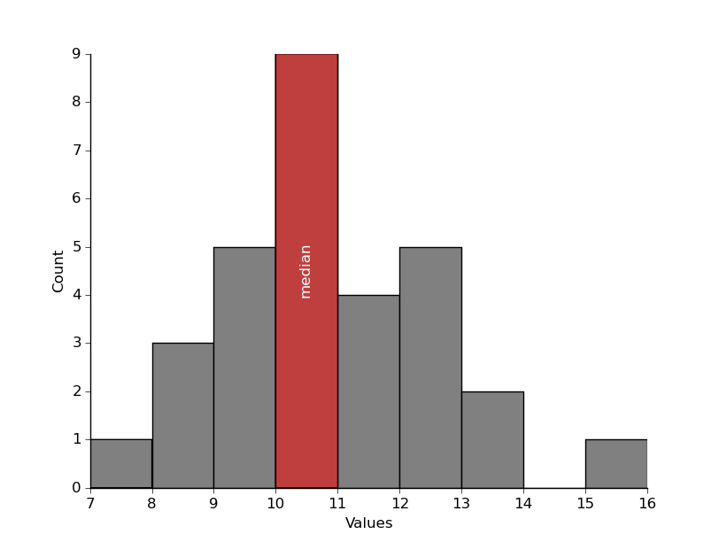

# Median Computation of Large Data Problem

## Description

Calculating the median requires all the data to be in memory at once. This is an issue in typical astrophysics calculations, which may use hundreds of thousands of exoplanets' dictionaries.

Even with a machine with lots of RAM, it's not going to be possible to find the median of billions of billions of real numbers.

This isn’t an issue for calculating the mean, since the sum only requires one real number to be added at a time. You can load a batch of real numbers, add them to the sum, and then reuse the memory. Since the sum is only ever the size of a single real number, you’ll never run out of memory.

If there were a way to calculate a "running median" you could save space by only having a batch of real numbers loaded at a time. Unfortunately, there’s no way to do an exact running median, but there are ways to do it approximately.

The [binapprox algorithm](http://www.stat.cmu.edu/~ryantibs/papers/median.pdf) does just this. The idea behind it is to find the median from the data's histogram.

## The binapprox algorithm

In order to find approximately the median, this algorithm uses two interesting properties of the median

### Property 1:

Firmally speaking, the median  of a random variable  is defined as any number such that:

  

The median  minimizes the following function:
<!--
m = \min\limits_{c} \;f(c) = \min\limits_{c}\; E(|X-c|)
-->

  

Why it is the case? Well, that's simply compute the derivative of this function to 0 and see which value solve it :)
<!--
\begin{align*}
0 = \frac{d}{dc}\;f(c)&=\frac{d}{dc}\;E(|X-c|)\\&= E(\frac{d}{dc}\,|X-c|) \\
&= E ( \;\mathbb{I} (X < c) - \mathbb{I} (X > c) \;)
\end{align*}
-->

  

where 𝟙 is the indicator function. To see why this is true, note that the derivative of |X-c| with respect to c equals +1 if x < c and -1 if x > c.  We can ignore the case x = c, since this single event has zero probability in the continuous space of events. Therefore, since:

  

thus, the derivative is 0 if and only if:

  

If we compare the definition of the median  and the last inequation, we automatically have:

  

<!--
\blacksquare 
-->

  

Now that we proved this first property, let's check another interesting property of the median.

### Property 2: The range existance of the median

If  is a random variable having mean , variance , and median , then:

  

This is an interesting property, but why it is true ? 

First of all, we know that:  
<!--
m \in [\mu-\sigma, \mu + \sigma] \iff |\mu - m | \leq \sigma
-->

  

So let's show the second inequality:

Let's start by rewriting step by step what    is.
<!--
\begin{align*}
|\mu - m| &= |E(X) - m|\\
&=|E(X) - E(m)|\\
&=|E(X - m)|
\end{align*}
-->

  

Now, since the absolute value function on the real numbers is convex, then we can apply the [Jensen's inequality](https://en.wikipedia.org/wiki/Jensen%27s_inequality) which stipulates that:
<!--
\text{f is convex} \iff f(E(X)) \leq E(f(X))
-->

  

 Thus, by taking f as the absolute value function, we have:
 <!--
\begin{align*}
|\mu - m| &= |E(X - m)|\\
&\leq E(|X - m|)
\end{align*}
-->

  

In the property 1 of this tutorial, we showed that the median  minimizes the following function:

  

Thus, we can write:

  

Additionally, since we have:
<!--
E(|X-\mu|) = E(\sqrt{  (X-\mu)^2})
-->

  

then the previous inequality becomes:

  

At this stage, we apply again the Jensen's inequality for the concave function f, the root square function:

  

Finally we have, just by the definition of the standart deviation:

  

  

Great! We have just shown that:

  

  

The median is the average of the 15th and 16th numbers in the ordered list (we can think of this as the 15.5th number). So, starting from the left, if we sum up the counts in the histogram bins until we get to just over 15.5 then we know the last bin we added must have contained the median.

In our example, the first 3 bins sum to 9 and the first 4 bins sum to 18, so we know that the median falls into the 4th bin (marked in red), and so it must be between 10 and 11.

We choose the middle (or midpoint) giving an estimate of 10.5.

##  Strengths and weaknesses of binapprox algorithm
* *Strength*: the runtime of binapprox doesn’t depend on the data’s distribution. It requires O(1) space, and doesn’t perturb the input. The algorithm has O(n) worst-case computational complexity, as it only needs 3 passes through the data:
  1. one pass to compute the mean and the standard deviation
  2. one pass to add each data point to its corresponding bin
  3. one pass to find the median
* *Weakness*: if the standard deviation is extremely large, the median approximation could be significantly different from the actual median.

# References
* [Ryan J. Tibshirani's paper](http://www.stat.cmu.edu/~ryantibs/papers/median.pdf)

