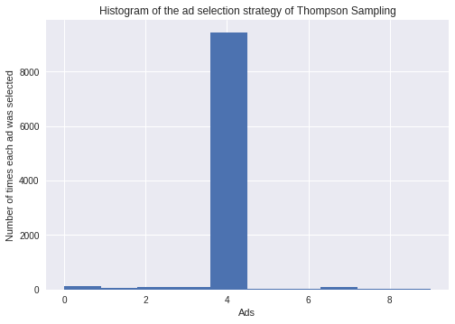

# Multi-armed bandit Problem

## Description

This folder contains three basic algorithms to solve the multi-armed bandit Problem:

* Random selection
* Upper Confidence Bound (UCB)
* Thompson Sampling

## Understanding the multi-armed bandit problem

## How to solve this problem

### Random selection

### Upper Confidence Bound

### Thompson Sampling



## Running
The results can reproduced by running each script with Python 3:
* Random selection
``` shell
python3 Random_Selection.py
```

* Upper Confidence Bound (UCB)
``` shell
python3 UCB.py
```

* Thompson_Sampling.py
``` shell
python3 Thompson_Sampling.py
```


