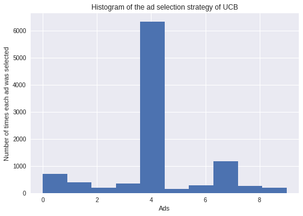

# Multi-armed bandit Problem

## Description

This folder contains three basic algorithms to solve the multi-armed bandit Problem:

* Random selection
* Upper Confidence Bound (UCB)
* Thompson Sampling

## Understanding the multi-armed bandit problem
Don't you love problems with such cool names in machine learning ? The multi-armed bandit problem is one problem that can be solved with reinforcement learning. First of all, what is a bandit ?

<p align="center">
  
</p>

As shown in the figure, a bandit is a slot machine. It is called specifically one-armed bandit because of the handle on the right that moves. In some places like casinos, you can still find these machines where you have to pull the handle. Nowadays, this process is likely electronic where you just press a button to initiate the game. Why it is called bandit ? Well, it is one of the quickest way on earth to loose your money in a casino. Some people even believe that companies that buil these machines put a bug into them to make people loose faster than what a simple probability computation reveals.

The multi-armed bandit problem is the challenge to *play with multiple one-armed bandit simultaneously*:

<p align="center">
  
</p>

Interestingly, many real problems can be reduced to the multi-armed bandit problem. In fact, any problem in which a fixed limited set of resources must be allocated between competing (alternative) choices in a way that maximizes their expected gain boils down to the multi-armed bandit problem. In order to convince you why this is true, let's take a real problem of the ad selection on a web page.

### Case study: the ad selection on a web page

Image that we have N ads that we display to users each time they connect to a web page. We can only display one ad each time the user ask for the web page. We would like to maximize the probability that user click on the ad so that we can earn an amount of dollars per click. as you can guess, the key question to answer is: which ad among the N ads we have should we display to maximize our profit ?

Where is the analogy with the multi-armed bandit problem ? Well, Let's consider:
* each ad as a bandit.
* displaying an ad is equivalent to play with one-armed bandit.
* the fact of earning an amount of dollars if the user click on the ad equivalent to earn an amount of dollars if we win a one-armed bandit game.

Then, solving the ad selection strategy on a web page is exactly equivalent to solving the multi-armed bandit game.

### The mathematical model of the multi-armed bandit problem

We assume that each one of these one-armed bandit has a distribution of outcomes out of which the machine picks results telling you if you win or loose. If we use our ad selection web page problem, each ad is a one-armed bandit that either tells you if you win an amount of dollars per click or not. For the sake of simplicity, let's choose the amount of dollars per click to be 1. Therefore, each ad give you an outcome, either 1 if you win (i.e. the user clicked on the ad) or 0 if not.

For each machine, this outcome comes from an unknown distribution. In the general case, each machine has its own distribution. Our goal is to figure out which machine has the best distribution for us. If we rephrase it in the context of the ad selection on a web page, our goal is to know which ad has the best distribution for us.

Let's take the example of 5 multi-armed bandit problem. Here are the distributions of each machine:

<p align="center">
  
</p>

As you can see, just by looking to these distributions, what is the best machine ? well it seems the rightmost machine with the orange distribution. Why ? Well, simply because it has the highest mean. So if you had 5 ads with these 5 distributions, the optimal solution would be to choose the ad with the orange distribution for each web page loading. Again, the problem is that we don't know these distributions in advance.

Thus, to figure it out, we need to try (i.e. accept to loose) and longer it takes us to figure it out, the more money we will spend on the wrong ones (i.e. any ad except the one with the orange distribution). So, the multi-armed bandit problem is a trade-off between the time we are going to spend to explore the machine outcomes to find out the best one, and we want to start to as quick as possible start exploiting the our finding to make money from ads. This is exactly what we call *the exploration–exploitation dilemma* in reinforcement learning.


## How to solve this problem

### Random selection
<p align="center">
  
</p>

### Upper Confidence Bound

<p align="center">
  
</p>

### Thompson Sampling

<p align="center">
  
</p>

## Running
The results can reproduced by running each script with Python 3:
* Random selection
``` shell
python3 Random_Selection.py
```

* Upper Confidence Bound (UCB)
``` shell
python3 UCB.py
```

* Thompson_Sampling.py
``` shell
python3 Thompson_Sampling.py
```

## Credit
Most of the figures are screenshots from the videos of the [_Data Science_](https://www.youtube.com/channel/UCVUxi39CNJGofN6-CZsA9TA) youtube channel.
