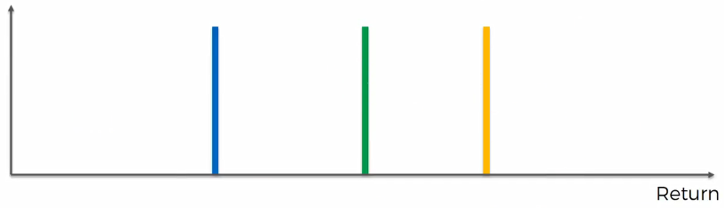

# Multi-armed bandit Problem

## Description

This folder contains three basic algorithms to solve the multi-armed bandit Problem:

* Random selection
* Upper Confidence Bound (UCB)
* Thompson Sampling

## Understanding the multi-armed bandit problem
Don't you love problems with such cool names in machine learning ? The multi-armed bandit problem is one problem that can be solved with reinforcement learning. First of all, what is a bandit ?

<p align="center">
  
</p>

As shown in the figure, a bandit is a slot machine. It is called specifically one-armed bandit because of the handle on the right that moves. In some places like casinos, you can still find these machines where you have to pull the handle. Nowadays, this process is likely electronic where you just press a button to initiate the game. Why it is called bandit ? Well, it is one of the quickest way on earth to loose your money in a casino. Some people even believe that companies that built these machines put a bug into them to make people loose faster than what a simple probability computation reveals.

The multi-armed bandit problem is the challenge to *play with multiple one-armed bandit simultaneously*:

<p align="center">
  
</p>

Interestingly, many real problems can be reduced to the multi-armed bandit problem. In fact, any problem in which a fixed limited set of resources must be allocated between competing (alternative) choices in a way that maximizes their expected gain boils down to the multi-armed bandit problem. In order to convince you why this is true, let's take a real problem of the ad selection on a web page.

### Case study: the ad selection on a web page

Image that we have N ads that we display to users each time they connect to a web page. We can only display one ad each time the user ask for the web page. We would like to maximize the probability that user click on the ad so that we can earn an amount of dollars per click. as you can guess, the key question to answer is: which ad among the N ads we have should we display to maximize our profit ?

Where is the analogy with the multi-armed bandit problem ? Well, Let's consider:
* each ad as a bandit.
* displaying an ad is equivalent to play with one-armed bandit.
* the fact of earning an amount of dollars if the user click on the ad equivalent to earn an amount of dollars if we win a one-armed bandit game.

Then, solving the ad selection strategy on a web page is exactly equivalent to solving the multi-armed bandit game.

### The intuition the multi-armed bandit problem

We assume that each one of these one-armed bandit has a distribution of outcomes out of which the machine picks results telling you if you win or loose. If we use our ad selection web page problem, each ad is a one-armed bandit that either tells you if you win an amount of dollars per click or not. For the sake of simplicity, let's choose the amount of dollars per click to be 1. Therefore, each ad give you an outcome, either 1 if you win (i.e. the user clicked on the ad) or 0 if not.

For each machine, this outcome comes from an unknown distribution. In the general case, each machine has its own distribution. Our goal is to figure out which machine has the best distribution for us. If we rephrase it in the context of the ad selection on a web page, our goal is to know which ad has the best distribution for us.

Let's take the example of 5 multi-armed bandit problem. Here are the distributions of each machine:

<p align="center">
  
</p>

As you can see, just by looking to these distributions, what is the best machine ? well it seems the rightmost machine with the orange distribution. Why ? Well, simply because it has the highest mean. So if you had 5 ads with these 5 distributions, the optimal solution would be to choose the ad with the orange distribution for each web page loading. Again, the problem is that we don't know these distributions in advance.

Thus, to figure it out, we need to try (i.e. accept to loose) and the longer it takes us to figure it out, the more money we will spend on the wrong ones (i.e. any ad except the one with the orange distribution). So, the multi-armed bandit problem is a trade-off between the time we are going to spend to explore the machine outcomes to find out the best one, and we want to start to as quick as possible start exploiting the our finding to make money from ads. This is exactly what we call *the exploration–exploitation dilemma* in reinforcement learning.

There is mathematical fundamental concept behind this reasoning which is called [_regret_](http://www.jmlr.org/papers/volume3/auer02a/auer02a.pdf). Basically, regret is what you are loosing by not playing the optimal machine. Each time you play a non-optimal machine, you have a regret which is the difference between the best outcome and the non best outcome. In our example, regret would be either 0 when we choose the optimal machine or 1 when we choose any non-optimal machine. As you can already notice, the longer you explore non-optimal machines, the higher regret you have. This is why many reinforcement learning papers quantify the performance of their algorithms by computing regret.

So how can we find the best machine and spend the least amount of time exploring non-optimal machines ? To answer this question, we need to simulate a situation where we try to answer the multi-armed bandit problem.

### Description of the data

The csv file *Ads_CTR_Optimisation.csv* contains the outcomes of loading 10 types of ads (i.e. number of columns) on a web page 10000 times (i.e. number of rows). For a given user, each one-armed bandit (i.e. ad) will output a binary outcome: 1 if the user clicked and thus we win an amount of money or 0 otherwise.

## How to solve this problem

We will explore three strategies to pick the best ad.

### Random selection

While one can assume that a random selection is definitely a bad choice, we want to make sure to use it as a baseline to compare other strategies with it. The following figure shows how often each ad has been selected. Without any surprise, the random strategy blindly explore the ads.

<p align="center">
  
</p>

### Upper Confidence Bound (UCB)

UCB is one of the most popular bandit algorithm because it is easy to implement and provides a good regret bounds.

#### Intuition behind the UCB algorithm

Imagine that we know the distribution behind each one-armed bandit. Let's first draw their means:

<p align="center">
  
</p>

Again, we don't know these values. Now, how does the UCB algorithm work. Well, it start by assuming the same expected return for each one-armed bandit since we do not distinguish initially between them:

<p align="center">
  
</p>

The UBC algorithm creates a confidence band around the expected return of each machine:

<p align="center">
  
</p>

The key idea of the UBC algorithm is that this confidence band is designed in such a way that *with a very high probability, the confidence band will include the expected return*.

In the beginning of the UBC algorithm, all machines have the same upper confidence bound. Let's say that we pick the machine in the middle:

<p align="center">
  
</p>

Using the ad selection example, let's say we place the ad in the middle and we want to see if the user click on it or not. Let's say the user did not click on it. Thus, the initial expected return (dashed red line) goes down and the confidence bound becomes smaller.

<p align="center">
  
</p>

Now, in the next round, we are going to should a machine which has which the highest upper confidence bound. In this case, it can be any machine except the one we have just picked. Let's say we pick the second rightmost machine and we get a positive reward (i.e. the user click on the ad):

<p align="center">
  
</p>

Again as you can notice, the initial expected return goes up and the upper confidence bound becomes smaller. The algorithm keeps running in the same way, and as long as we have more observations about a specific machine, its upper confidence bound becomes smaller and smaller, which means that our the expected return of that machine converges to the real expectation of the distribution. After playing multiple rounds, the final upper bounds would look like the following:

<p align="center">
  
</p>

#### The mathematical justificiation behind UCB

This [_blog_](http://banditalgs.com/2016/09/18/the-upper-confidence-bound-algorithm/) provides a good mathematical explanation of the upper confidence term which has this nice property to decrease over time.

---

When we run the UCB algorithm, we found the frequency of selecting ads as follows:

<p align="center">
  
</p>

As you can notice, the best ad to selected found by the algorithm is 4.

### Thompson Sampling

Thompson sampling is another popular algorithm to solve the multi-armed problem.

#### The intuition behind Thompson Sampling

In order to get the intuition behind this method, let's consider the problem of selecting the best ad among 3 ads instead of 5 ads like we did in the UCB algorithm. Let's imagine that we know the expected return of each one of the 3 ads:

<p align="center">
  
</p>

In reality, we don't know of course these expected values. If we do, it is obvious that rightmost machine (i.e. having the orange expected return) is the best one to choose all the time. For now, we just use it to better understand what Thompson sampling does.

At the beginning, we just start to try each ad few times. Let's say we have few trials of the leftmost machine:

<p align="center">
  
</p>

Based on those trials, the algorithm constructs a distribution.

<p align="center">
  
</p>

This is where Thompson Sampling starts to be different from the UCB algorithm. We will get to the meaning of this distribution in a second. Let's have trials from the two other ads and construct their corresponding distributions:

<p align="center">
  
</p>

The meaning of these distributions is confusing. These distributions are not representing the distribution behind the machine. The first thing that might come to mind is that we are trying to construct distributions that approximate the real distribution of the expected outcome of each machine. **This is not the case**. These distributions are constructing something completly different: we are constructing distributions of **where we think the actual expected return might lie**. It is very important to understand this point. In other words, we are creating a proxy mechanism to solve the problem. Since we don't know the value of the expected return, we construct a distribution that tells us where the expected return might be.

Now, how can the algorithm choose the best machine based on the distribution of the expected return location of each each machine ?
Tompson sampling will sample a value out of each machine distribution. These values are sampled according to the distribution, meaning that it is more likely to pull a value near the mean that from the tail.

<p align="center">
  
</p>

As shown in the figure above, we might pull values from distributions such that the sample of the best distribution (i.e. the orange distribution) is lower that the one coming from a non-optimal distribution (i.e. the green distribution).

Now, based on these samples, we pick the machine that has the maximum value. In this case, the algorithm will pick the machine in the middle (i.e. the green one).

<p align="center">
  
</p>

However, over the long run, we will pick values that are closer to the center, simply because they are more probable. Thus, if these samples are near the center of each distribution, then will pick the best distribution all the time.

Finally, we will use these three samples from these three distribution to update the distributions.

<p align="center">
  
</p>

This is why Thompson sampling is based on bayesian inference, simply because it uses the current distributions as a prior to compute the updates distributions (i.e. posterior) using the sampled values (i.e. likelihood).

#### The mathematical justificiation behind UCB

This [_paper_](https://arxiv.org/abs/1707.02038) provides a very good explanantion of Thompson sampling.

---

When we run the Thompson sampling algorithm, we found the frequency of selecting ads as follows:

<p align="center">
  
</p>

As you can notice, the best ad to selected found by the algorithm is 4, exactly as the UCB algorithm.

## Comparison

| Method | Total reward | Best ad |
| :---: | :---: | :---: |
| Random Sampling | 1301 | Unknown |
| UCB | 2178 | 4 |
| Thompson Sampling | 2611 | 4 | 

## Running
The results can reproduced by running each script with Python 3:
* Random selection
``` shell
python3 Random_Selection.py
```

* Upper Confidence Bound (UCB)
``` shell
python3 UCB.py
```

* Thompson_Sampling.py
``` shell
python3 Thompson_Sampling.py
```

## Credit
Most of the figures are screenshots from the videos of the [_Data Science_](https://www.youtube.com/channel/UCVUxi39CNJGofN6-CZsA9TA) Youtube channel.
