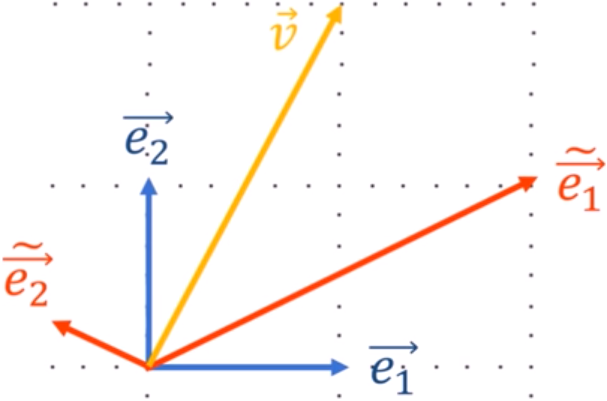

# Natural Gradient Method

## Description
This repository provides the description and the implementation of the natural gradient method.

## Assumptions of the natural gradient method

To guarantee the convergence, this method assume the following assumptions:

* f is *twice differentiable* (i.e. twice Lipschitz continuously):
<!--
\| \nabla^2f(x) - \nabla^2f(y)\| \leq \gamma \; \| x -y\|
-->
<p align="center">
  
</p>

* first order stationarity assumption:
<!--
\| \nabla f(\textbf{x}^*)\| = \textbf{0}
-->
<p align="center">
  
</p>

* the Hessian of f is positive definite (i.e. all the eigenvalues of the Hessian are strictly positive)

Now that we defined the assumption of the natural gradient method, and before digging into its technical details, we should review the basic concepts behind standard gradient descent and understand some of its performance limitations.

## Review of the standard gradient descent method

To describe standard gradient descent method, we consider a function  to minimize with respect to its parameters:
<!--
\textbf{w}(k) = [\;w_1(k), w_2(k), \dots, w_n(k)\;]^T
-->
<p align="center">
  
</p>

where  is the ith parameter value at time k.

The standard descent method is an iterative procedure for locally-minimizing  with respect to , defined as:
<!--
\textbf{w}(k+1) = \textbf{w}(k) - \eta \; \frac{\partial f(\textbf{w}(k))}{\partial \textbf{w}}
-->
<p align="center">
  
</p>

where  is a fixed step size. Many adaptative variants of the standard gradient descent makes the step size dependent on time using different strategies. However, we choose to  to be constant since this is not related to the deep understanding of the natural gradient.

The standard gradient descent equation tells us that a fraction  of the gradient of the function  with respect to each parameter is subtracted from each parameter . This process is continued indefinitely or until the value of  reaches a suitably-small value, at which point  is close to .

### Beyond the limitation of the standard gradient descent:

#### Limitation of the standard gradient descent
The transient behavior of any gradient descent method depends on the form of . One major limitation stems from the fact that the gradient components  **vary widely
in magnitude in different directions** from .

#### Intuition behind the natural gradient descent
The key idea of gradient descent is that *not all parameters are equal: rather than treating a change in every parameter equally, we need to scale each parameter's change according to how much it affects the function*. In other words, **we need to tell the gradient descent to substract a different portion of the gradient for each parameter**.

Before understanding the natural gradient equation, let's just see what does it look like:
<!--
\textbf{w}(k+1) = \textbf{w}(k) - \eta \; \textbf{G}^{-1}(\textbf{w}(k))\;\frac{\partial f(\textbf{w}(k))}{\partial \textbf{w}}
-->
<p align="center">
  
</p>

Well, this looks very similar to the gradient descent equation without the new term  which is a matrix that multiplies the gradient to adjust the gradient of each parameter  that should be substracted from .

In the rest of this tutorial, we will explain from where is this matrix coming and what advantage does it provide comparing to the standard gradient descent. It is time to dive into the technical details of this intuition :)

## Understanding the natural gradient:

We want to find the best distance to decrease the function  in each direction. Since  is a high dimensional function, we can imagine intuitively a high dimensional curved function where the shortest distance between two points is not a straight line anymore. In other words, the fundamental notion of distance as defined in the Euclidian geometry is no longer valid because it does not take into account the characteristics of the parameter space.

In other words, we need to make sure to have the accurate distance metric to navigate in the parameter space. This means that we should be able to compute the shortest distance between two points in our parameter space even if it is not a straight line. For instance, how can we measure the distance between two cities on our spherical earth. Well, these types of problems can be solved by using the [Riemannian geometry](https://en.wikipedia.org/wiki/Riemannian_geometry). Euclidian geometry holds only when the plan is flat.

So we want to understand how the term  allows us to measure the distances on curved plans.

To do so let's study a basic example.

### Example: how do we get the length of a vector ?

Let's consider the vector  in  with the two different bases:
<!--
{\color{Blue} (\;\vec{e_1}, \vec{e_2}\;)}
{\color{DarkOrange} (\;\tilde{\vec{e_1}}, \tilde{\vec{e_2}}\;)}
-->
* : an orthonormal basis.
* : a non orthonomal basis.

<p align="center">
  
</p>

Thus, we can write the vector  in the two basis as follows:
<!--
\begin{align*}
\vec{v} &=  (v_1 \,{\color{Blue}\vec{e_1}}, v_2 \,{\color{Blue}\vec{e_2}})\\
&=  (\tilde{v_1} \,{\color{DarkOrange}\tilde{\vec{e_1}}}, \tilde{v_2} \,{\color{DarkOrange}\tilde{\vec{e_2}}})
\end{align*}\\
-->
<p align="center">
  
</p>

To compute the norm of , the most obvious way is to apply the Pythagoras theorem:

<p align="center">
  
</p>

Or simply by remembering the fact that:
<p align="center">
  
</p>

Thus we have:
<!--
\begin{align*}
\|\vec{v}\|^2 &=  \vec{v}\ \cdot \vec{v}\\
&=  (v_1 \,{\color{Blue}\vec{e_1}}, v_2 \,{\color{Blue}\vec{e_2}}) \cdot (v_1 \,{\color{Blue}\vec{e_1}}, v_2 \,{\color{Blue}\vec{e_2}})\\
&=  v_1^2 \;({\color{Blue}\vec{e_1}},\,{\color{Blue}\vec{e_2}}) + v_1 v_2 \;({\color{Blue}\vec{e_1}},\,{\color{Blue}\vec{e_2}}) + v_2 v_1 \;({\color{Blue}\vec{e_2}},\,{\color{Blue}\vec{e_1}}) + v_2^2\, ({\color{Blue}\vec{e_2}},\,{\color{Blue}\vec{e_2}})\\
&= v_1^2 + v_2^2\\
\end{align*}
-->
<p align="center">
  
</p>

and we find ourselves applying the Pythagorean theorem again since we are using an orthonomal basis. This tells us that the Pythagorean theorem is a special case of the previous formula.

Interestingly, we can rewrite the previous formula in the matrix form as follows:
<!--
\begin{align*}
\|\vec{v}\|^2 &=
\begin{bmatrix}
    v_{1} & v_{2} 
\end{bmatrix}
\begin{bmatrix}
    {\color{Blue}\vec{e_1}} \cdot {\color{Blue}\vec{e_1}} & {\color{Blue}\vec{e_2}} \cdot {\color{Blue}\vec{e_1}} \\
    {\color{Blue}\vec{e_1}} \cdot {\color{Blue}\vec{e_2}} & {\color{Blue}\vec{e_2}} \cdot {\color{Blue}\vec{e_2}}
\end{bmatrix}
\begin{bmatrix}
    v_{1} \\ v_{2} 
\end{bmatrix} \\&= 
\begin{bmatrix}
    v_{1} & v_{2} 
\end{bmatrix} \qquad
\begin{bmatrix}
    {\color{Blue}1} & {\color{Blue}0} \\
    {\color{Blue}0} & {\color{Blue}1}
\end{bmatrix}\qquad
\begin{bmatrix}
    v_{1} \\ v_{2} 
\end{bmatrix} \\
&= \quad \;\;\vec{v}^T\ \qquad \;\;\;
\begin{bmatrix}
    {\color{Blue}1} & {\color{Blue}0} \\
    {\color{Blue}0} & {\color{Blue}1}
\end{bmatrix}\qquad
\;\;\;\vec{v}
\end{align*}
-->
<p align="center">
  
</p>

In other words, the norm square of any vector  in a basis  can be written as follows:

<p align="center">
  
</p>

where  is the matrix of all dot products between all the possible pairs of the basis vectors of .

This is a very important formula to know. If the basis is orthonormal, then  is the identity matrix. When the basis vectors are not orthogonal, then non diagonal elements are not zero. 

Cool! What if we ask you to compute the norm of  using the non orthonormal basis  ?

Well, we can keep using the previous formula in the new basis :
<!--
\begin{align*}
\|\vec{v}\|^2 &=  \vec{v}\ \cdot \vec{v}\\
&=  (\tilde{v_1} \,{\color{DarkOrange}\tilde{\vec{e_1}}}, \tilde{v_2} \,{\color{DarkOrange}\tilde{\vec{e_2}}}) \cdot (\tilde{v_1} \,{\color{DarkOrange}\tilde{\vec{e_1}}}, \tilde{v_2} \,{\color{DarkOrange}\tilde{\vec{e_2}}})\\
&=  \tilde{v_1}^2 \;({\color{DarkOrange}\tilde{\vec{e_1}}},\,{\color{DarkOrange}\tilde{\vec{e_2}}}) + \tilde{v_1} \tilde{v_2} \;({\color{DarkOrange}\tilde{\vec{e_1}}},\,{\color{DarkOrange}\tilde{\vec{e_2}}}) + \tilde{v_2} \tilde{v_1} \;({\color{DarkOrange}\tilde{\vec{e_2}}},\,{\color{DarkOrange}\tilde{\vec{e_1}}}) + \tilde{v_2}^2\, ({\color{DarkOrange}\tilde{\vec{e_2}}},\,{\color{DarkOrange}\tilde{\vec{e_2}}})
\end{align*}
-->
<p align="center">
  
</p>

In a smiliar way as for the orthonormal basis, we can rewrite the previous formula in the matrix form as follows:
<!--
\begin{align*}
\|\vec{v}\|^2 &=
\begin{bmatrix}
    \tilde{v_{1}} & \tilde{v_{2}} 
\end{bmatrix}
\begin{bmatrix}
    {\color{DarkOrange}\tilde{\vec{e_1}}} \cdot {\color{DarkOrange}\tilde{\vec{e_1}}} & {\color{DarkOrange}\tilde{\vec{e_2}}} \cdot {\color{DarkOrange}\tilde{\vec{e_1}}} \\
    {\color{DarkOrange}\tilde{\vec{e_1}}} \cdot {\color{DarkOrange}\tilde{\vec{e_2}}} & {\color{DarkOrange}\tilde{\vec{e_2}}} \cdot {\color{DarkOrange}\tilde{\vec{e_2}}}
\end{bmatrix}
\begin{bmatrix}
    \tilde{v_{1}} \\ \tilde{v_{2}} 
\end{bmatrix} \\&= 
\begin{bmatrix}
    \tilde{v_{1}} & \tilde{v_{2}}
\end{bmatrix} 
\begin{bmatrix}
    {\color{DarkOrange}5} & {\color{DarkOrange}-3/4} \\
    {\color{DarkOrange}-3/4} & {\color{DarkOrange}5/16}
\end{bmatrix}\;
\begin{bmatrix}
    \tilde{v_{1}} \\ \tilde{v_{2}}
\end{bmatrix} \\
&= \quad \;\;\vec{v}^T\;\;\,
\begin{bmatrix}
    {\color{DarkOrange}5} & {\color{DarkOrange}-3/4} \\
    {\color{DarkOrange}-3/4} & {\color{DarkOrange}5/16}
\end{bmatrix}\,
\;\;\;\vec{v}
\end{align*}
-->
<p align="center">
  
</p>

where the values 5, -3/4 and 5/16 of  are computed based on the given example.

Before we describe the optimization problem behind the natural gradient, let's recap what we have learnt so far:
1. we need to adjust the standard gradient descent by substracting a different portion of the gradient for each parameter .
2. Thus, we need mesure the best distance to decrease the function  in each direction.
3. This is why we need to be able to measure the distance even if the plan is not flat by taking into consideration the fact that our parameter space can be curved. We do that by using the Riemannian geometry.
4. This means that each time we want to compute a distance, the matrix of all pairs of dot products between the parameter space's basis vectors should be taken into account. We called this matrix . This matrix is called the [metric tensor](https://en.wikipedia.org/wiki/Metric_tensor). It is a very well known tensor in differential geometry and extensively used in general relativity.

Now, it is a great time to introduce the optimization problem of the natural gradient :)

### The optimization problem behind the natural gradient

Given a function , we would like to find the best direction  in the parameter space of   to take in order to decrease the function.

Let's formalize this sentence. We are looking for the best direction  that can be written as:
<p align="center">
  
</p>

where . In other words, we choose the norm of the direction to be  and we would like to minimize:
<!--
f(\textbf{w + dw}) = f(\textbf{w}) + \eta \; \nabla f(\textbf{w})^T \textbf{a}
-->
<p align="center">
  
 </p>

with respect to  under the constraint:
<!--
\|\textbf{a}\|^2 = 1 = \textbf{a}^T \,\textbf{G} \;\textbf{a}
-->
<p align="center">
  
</p>
 
Now we see why we introduced the metric tensor  in the previous section :)
 
Now we have a classical constrained optimization which can be solved with the [Lagrangean multiplier method](https://en.wikipedia.org/wiki/Lagrange_multiplier). This is a very known method. If you don't know about it, you can easily understand it. [Just google it](http://lmgtfy.com/?q=Lagrange+multiplier)!

The Lagrangean multiplier method adds the constraint to the initial optimization function :
<!--
f(\textbf{w + dw}) = f(\textbf{w}) + \eta \; \nabla f(\textbf{w})^T \textbf{a} - {\color{DarkGreen} \lambda \,\textbf{a}^T \,\textbf{G} \;\textbf{a}}
-->
<p align="center">
  
</p>

We want to find the best  that minimizes . Thus we samply set its gradient with respect to  to 0:
<!--
\frac{\partial f(\textbf{w + dw})}{\partial \textbf{a}} = \textbf{0} = \eta \; \nabla f(\textbf{w})^T - \lambda \,\textbf{G} \;\textbf{a}
-->
<p align="center">
  
</p>


<!-- 
Although
the natural gradient is local in nature and only depends
on the parameter values w(k), determining G(w)
usually requires precise knowledge of the problem structure.
However, the information needed to form G(w) varies from
problem to problem, and there exist several practical cases
where this information is easily o

-->

---
We define the optimization problem as:
<!--
\textbf{x}^* = \min\limits_{\textbf{x}} \;f(\textbf{x})
-->
<p align="center">
  
</p>


## Newton's method

The Newton's method approximate the function f using a second-order Tayolor expansion:
<!--
f(x+\upsilon) \approx \hat{f}(x+\upsilon) = f(x) + \nabla f(x)^T \upsilon + \frac{1}{2}\; \upsilon^T \;\nabla^2 f(x)\; \upsilon
-->
<p align="center">
  
</p>

which is a convex quadratic function of . In other words, the newton's method tries to find what should be the direction  added to the point x to minimize the second-order approximation of f at x, .

In order to do find the best , we set the derivative of the quadratic approximation to 0 and solve it with respect to :
<!--
\textbf{0} = \nabla f(x+\upsilon) \approx \nabla \hat{f}(x+\upsilon) = \nabla f(x) + \nabla^2 f(x)\; \upsilon
-->
<p align="center">
  
</p>

Thus, we can conclude that the best  is:
<!--
\upsilon^* = -\big[ \nabla^2 f(x) \big]^{-1} \;\nabla f(x)
-->
<p align="center">
  
</p>

 is know as the Newton step. It is the descent direction that Newton's method uses to minimize f.

## Pros and cons:

If the function f is quadratic, then x +  is the exact minimizer of f. If the function f is nearly quadratic, intuition suggests that  should be a very good estimate of the minimizer of f, i.e., . In other words, the performance of Newton's method depends on how good the quadratic approximation is.


## Implementation

We implemented the Newton's method in Python 3 using PyTorch. We chose the function  where .

You can simply use the code by running:
``` shell
python3 Newton_Method.py
```

## References
* [Amari's Paper - Why Natural Gradient?](http://citeseerx.ist.psu.edu/viewdoc/download?doi=10.1.1.76.7538&rep=rep1&type=pdf): this is a light paper that focuses on the intuition and examples to understand natural gradient.
* [Amari reference paper about natural gradient](http://citeseerx.ist.psu.edu/viewdoc/download?doi=10.1.1.452.7280&rep=rep1&type=pdf): this is the original paper to understand natural gradient.
* [The Youtube playlist "What is a Tensor?"](https://www.youtube.com/playlist?list=PLRlVmXqzHjUQARA37r4Qw3SHPqVXgqO6c): this is a great series of lessons intended to assist those who want to learn about the fundamental background behind the theory of general relativity. I highly recommend it.
